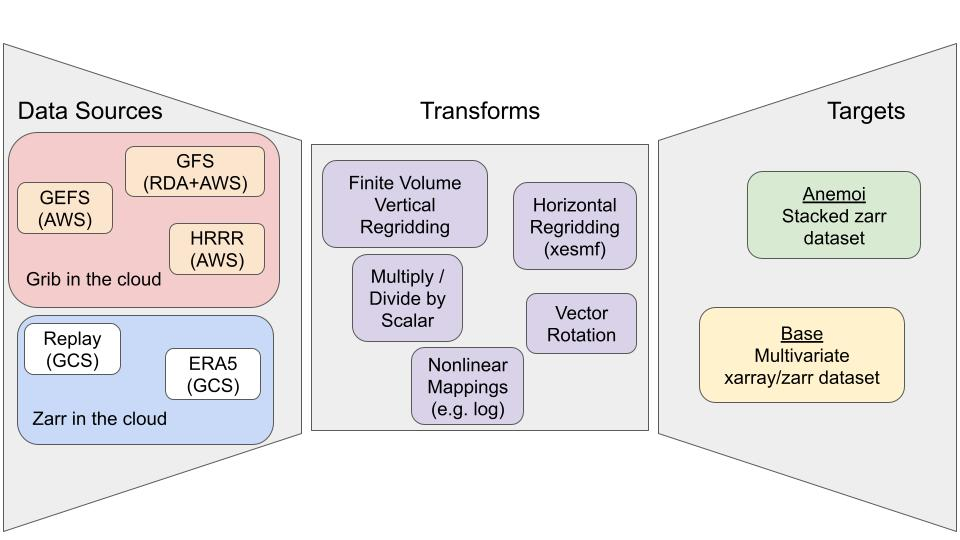

Overview of Capabilities
------------------------

ufs2arco is designed to make NOAA forecast, reanalysis, and reforecast datasets
more accessible for scientific analysis and machine learning.
The package is specifically designed to let users run an Extract, Transform, Load (ETL)
pipeline which converts NOAA datasets into a format suitable for their uses.
There are three general concepts that are important for the workload:

* **Data Source**: the original source of data, for example the
  :ref:`archives from NOAA's Global Ensemble Forecast System (GEFS)<gefs-archive>`

* **Transforms**: any operations that the user needs to perform on the data, for
  example regridding via `xesmf <https://xesmf.readthedocs.io/en/stable/>`_ 

* **Target**: which defines the resulting dataset layout. Right now there are two
  target layouts:

  1. "base": which puts the dataset in a familiar form where all variables and
     dimensions are easily exposed for analysis. See for example
     `NOAA's UFS Replay <https://nbviewer.org/gist/timothyas/f37ec28562e97c74217401fceb144f1f>`_
     on Google Cloud Storage for an example of this output format.

  2. "anemoi": which makes the dataset ready for Machine Learning model
     development using the `anemoi framework
     <https://anemoi.readthedocs.io/en/latest/>`_.
     Documentation regarding this format is coming, but in the meantime,
     check out the `anemoi-datsets documentation
     <https://anemoi.readthedocs.io/projects/datasets/en/latest/>`_ for more
     information on this data format. 

The capabilities and datasets available are illustrated by the schematic below:

