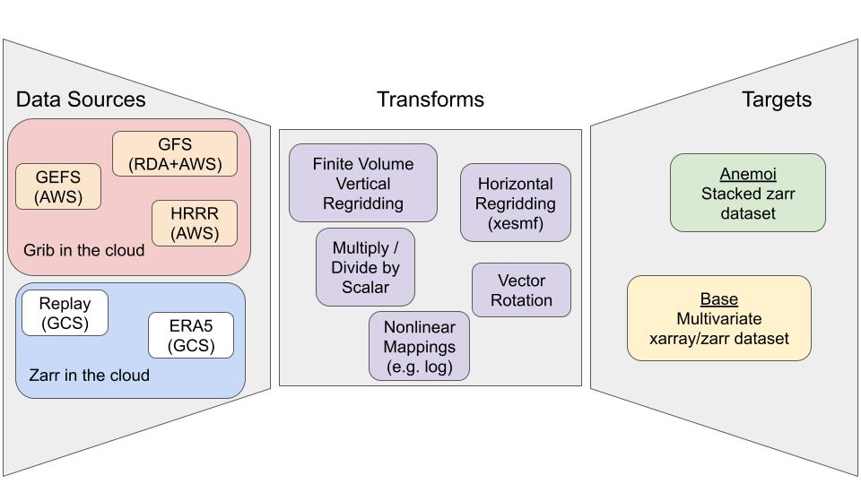

.. ufs2arco documentation master file, created by
   sphinx-quickstart on Wed Nov 15 16:50:45 2023.
   You can adapt this file completely to your liking, but it should at least
   contain the root `toctree` directive.

ufs2arco
========

ufs2arco is a python package that is designed to make `NOAA <https://www.noaa.gov/>`_
forecast, reanalysis, and reforecast datasets
more accessible for scientific analysis and machine learning model development.
The name stems from its original intent, which was to transform output from the
`Unified Forecast System (UFS) <https://www.ufs.epic.noaa.gov/>`_
into
Analysis Ready, Cloud Optimized (ARCO;
`Abernathey et al., (2021) <https://doi.ieeecomputersociety.org/10.1109/MCSE.2021.3059437>`_)
format.
However, the package now pulls data from a number of non-UFS sources, including GFS/GEFS
before UFS was created, and even
`ECMWF's ERA5 dataset <https://www.ecmwf.int/en/forecasts/dataset/ecmwf-reanalysis-v5>`_.

.. warning::
    The documentation is very much a work in progress.
    If you have any questions, feel free to raise an issue on the GitHub repo
    (see "Getting Support" in the Table of Contents).

Capability Overview
###################

The package is specifically designed to let users run an Extract, Transform, Load (ETL)
pipeline which converts NOAA datasets into a format suitable for their uses.
There are three general concepts that are important for the workload:

* **Data Source**: the original source of data, for example the
  :ref:`archives from NOAA's Global Ensemble Forecast System (GEFS)<gefs-archive>`

* **Transforms**: any operations that the user needs to perform on the data, for
  example regridding via `xesmf <https://xesmf.readthedocs.io/en/stable/>`_ 

* **Target**: the resulting dataset is stored in `zarr <https://zarr.dev/>`_ format,
  and the "target" defines its layout. Right now there are two
  target layouts:

  1. **base**: which puts the dataset in a familiar form where all variables and
     dimensions are easily exposed for analysis. See 
     `NOAA's UFS Replay <https://nbviewer.org/gist/timothyas/f37ec28562e97c74217401fceb144f1f>`_
     on Google Cloud Storage for an example of this output format.

  2. **anemoi**: which makes the dataset ready for machine learning model
     development using the `anemoi framework
     <https://anemoi.readthedocs.io/en/latest/>`_.
     Documentation regarding this layout is coming, but in the meantime,
     check out the `anemoi-datsets documentation
     <https://anemoi.readthedocs.io/projects/datasets/en/latest/>`_ for more
     information on this data layout. 

The capabilities and datasets available are illustrated by the schematic below:

Table of Contents
#################

.. toctree::
   :maxdepth: 1
   :caption: Getting Started

   installation
   moving_data

.. toctree::
   :maxdepth: 1
   :caption: Data Sources

   aorc
   gefs_archive
   gfs_archive
   hrrr_archive

.. toctree::
   :maxdepth: 1
   :caption: Examples

   Interpolate FV3 to Pressure Levels <example_pressure_interpolation>

.. toctree::
   :maxdepth: 1
   :caption: Community

   contributing
   support

.. toctree::
   :maxdepth: 1
   :caption: References

   api
